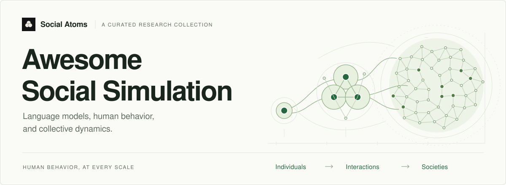

# Awesome Social Simulation [](https://awesome.re)

<a href="https://social-atoms.github.io/awesome-social-sim/">
  <picture>
    <source media="(prefers-color-scheme: dark)" srcset="docs/assets/readme-hero-dark.svg">
    
  </picture>
</a>

A curated reading list on **LLM-based simulation of human behavior and social interaction**. Each entry explains why the paper belongs, with links to its publication and supporting resources.

**[Browse the website](https://awesome.social-atoms.org/)** · [Suggest a paper](https://github.com/Social-Atoms/awesome-social-sim/issues/new?template=paper-suggestion.yml) · [Report a correction](https://github.com/Social-Atoms/awesome-social-sim/issues/new?template=correction.yml)

The website supports search, topic and year filters, and shareable views. The same collection is available below as Markdown; a paper can appear in more than one topic.

New to the field? The [illustrated field guide](https://social-atoms.github.io/awesome-social-sim/#field-guide) connects individual behavior, social interaction, and collective dynamics, alongside a diagram of the research and validation loop. Both diagrams are downloadable SVGs with background reading; the landscape map links directly to related papers.

<!-- catalogue:start -->

## Browse by topic

**14 papers · 5 topics.** A paper can appear in several topics.

| Topic                                                      | Focus                                                                                    | Papers |
| ---------------------------------------------------------- | ---------------------------------------------------------------------------------------- | -----: |
| [Control and calibration](<tags/control-calibration.md>)   | Methods that measure, control, or calibrate simulated behavior toward specified targets. |      3 |
| [Evaluation](<tags/evaluation.md>)                         | Benchmarks or human-grounded checks of simulation fidelity and social behavior.          |      8 |
| [Silicon participants](<tags/silicon-participants.md>)     | Simulated human participants, including survey and questionnaire responses.              |      5 |
| [Social science experiments](<tags/social-experiments.md>) | Simulations based on behavioral, psychology, or economics experiments.                   |      5 |
| [Multi-agent interaction](<tags/multi-agent.md>)           | Multiple agents interact and influence one another.                                      |      6 |

<!-- catalogue:end -->

## What belongs here

- Original research and benchmarks published or accepted in a main conference track or established journal, plus selected position papers that directly address social simulation.
- Work making a substantive claim about simulated human behavior, social interaction, or collective dynamics, or providing methods to test those claims.
- Verifiable publication or acceptance evidence. Accepted papers are labeled as such until proceedings are available; position papers are identified explicitly.

Standalone preprints, workshop-only papers, surveys, and general-purpose multi-agent task solving are outside the current scope. An earlier workshop appearance can be recorded as publication history after a paper qualifies for inclusion. Venue distinctions are factual context, not a ranking of papers.

## Help improve the collection

The two issue forms linked at the top of this page take a suggestion or a correction without any editing of code. Include a source and a short explanation of the paper's relevance.

For a pull request, edit one record in `data/papers/`, then run the generator to update every relevant topic page and the website. See [CONTRIBUTING.md](CONTRIBUTING.md) for the review criteria and exact steps.

## Repository structure

| Path                                           | Purpose                                                      |
| ---------------------------------------------- | ------------------------------------------------------------ |
| [`data/papers/`](data/papers/)                 | One canonical JSON record per paper.                         |
| [`data/topics.json`](data/topics.json)         | Topic IDs, labels, and descriptions.                         |
| [`data/collection.json`](data/collection.json) | Collection update date.                                      |
| [`tags/`](tags/)                               | Generated Markdown topic pages for browsing on GitHub.       |
| [`site/`](site/)                               | Website template, styles, scripts, and assets.               |
| [`scripts/`](scripts/)                         | Standard-library Python validation and build tools.          |
| [`tests/`](tests/)                             | Checks for catalogue and build behavior.                     |
| [`.github/`](.github/)                         | Contribution forms, validation, and GitHub Pages deployment. |
| [`docs/`](docs/)                               | Data format and maintenance instructions.                    |

## Build and preview

Requires **Python 3.11 or newer**. There are no Python packages or npm dependencies to install.

```sh
python3 scripts/build.py
python3 -m http.server 4173 --directory dist
```

Open [localhost:4173](http://localhost:4173/). `dist/` is generated and is not committed. GitHub Actions builds and deploys the website from `main`; pull requests validate changes without publishing them. See [maintenance and deployment](docs/maintaining.md).

Social Atoms branding and the bundled font are documented in [third-party notices](THIRD_PARTY_NOTICES.md).
